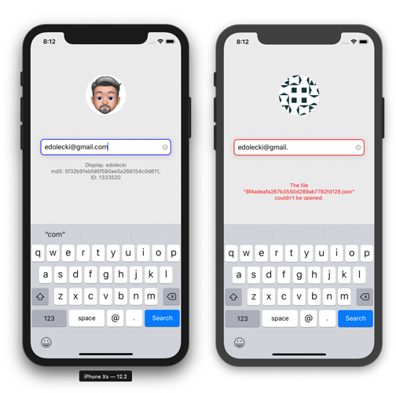

 

----

# GravatarGet
Getting a gravatar image and profile information from an email address that gets md5 hashed. The Gravatar APIs are not difficult to use by any means, but it introduces the need to md5 hash an email address and use that in the API calls for both avatar image and also the profile data. So this is mainly an excercise in hashing.

The requested avatar image delivers either existing image or a default image (random pattern based upon the email hash). 

I am using .json for the requested and returned profile data. I am handling errors.

Because the root of the profile JSON is an array with a single item, it made parsing a little different. Using Codable structs to handle that which makes parsing so much easier than before.

There is rudimentary support for email address validation as one types. You can always kick off a search no matter what the text input field contains. Errors are handled in the user interface.

----

